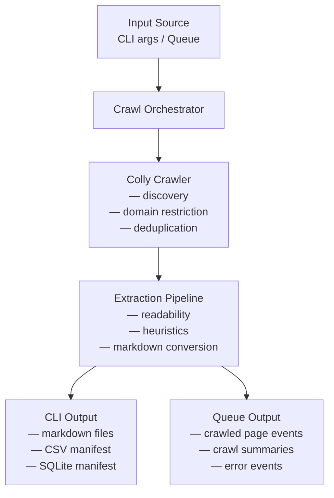

# ThinkPixelSpider

> A focused web crawler for article extraction, Markdown conversion, and semantic search ingestion.

ThinkPixelSpider is a web crawler and article extraction service built for content indexing pipelines, semantic search, and website content ingestion.

It is designed primarily for **WordPress-style article websites**, where pages share a common structure and the main goal is to discover article pages, extract the readable content, convert it to Markdown, and emit the results in a format that is easy to index or process downstream.

The project supports two execution modes:

- **CLI mode** for local crawling and offline exports
- **Daemon mode** for queue-driven, distributed crawling in Kubernetes or similar environments

## 🎯 Goals

ThinkPixelSpider is built to:

- crawl a target website safely and efficiently
- stay within the boundaries of the target domain
- avoid crawling the same page multiple times
- discover article pages using sitemaps and internal links
- extract the readable content from HTML pages
- convert extracted content to Markdown
- output content either to local files or message queues
- support simple local usage as well as distributed deployments

## 💡 Core ideas

The crawler follows a layered extraction strategy:

1. **Readability first**
   Use a readability-based extractor to identify the main article content.

2. **Template heuristics second**
   Apply additional heuristics to reject boilerplate-heavy or low-value pages.

3. **DOM differencing third**
   Optionally extend extraction with smarter template comparison techniques for sites where readability alone is not enough.

This makes ThinkPixelSpider practical for a strong first version while leaving room for more advanced site-structure inference later.

## ✨ Features

- built in Go
- crawling powered by [Colly](https://github.com/gocolly/colly)
- article extraction powered by [go-readability](https://github.com/go-shiori/go-readability)
- HTML to Markdown conversion
- CLI mode for filesystem-based output
- daemon mode for queue-based operation
- pluggable queue backends
  - Redis
  - NATS
- pluggable Colly storage
  - in-memory
  - Redis
- environment-variable-based configuration
- Kubernetes-friendly worker model
- output manifest in CSV or SQLite
- deterministic URL-to-file mapping
- deduplication and domain restriction support

## 🏗️ Planned architecture



## ⚙️ Execution modes

### CLI mode

In CLI mode, ThinkPixelSpider accepts a domain as input and an output folder as destination.

It crawls the target site, extracts readable content from relevant pages, converts it to Markdown, and writes:

* Markdown files containing extracted page content
* a manifest file in either CSV or SQLite format mapping:

  * crawled URL
  * canonical URL
  * relative output path
  * title
  * metadata
  * crawl status

Example output structure:

```text
output/
  manifest.sqlite
  pages/
    example.com/
      blog/
        hello-world.md
      2026/
        03/
          another-post.md
```

### Daemon mode

In daemon mode, ThinkPixelSpider runs as a worker service.

It consumes crawl jobs from an input queue and publishes extracted page results to an output queue.

Typical use case:

* input queue receives domains or crawl jobs
* one or more crawler workers process jobs
* output queue receives extracted page content and metadata
* downstream systems embed, index, or store the results

This mode is intended to be compatible with distributed deployments such as Kubernetes.

## 📬 Queue backends

ThinkPixelSpider is designed around queue abstractions, so different backends can be supported.

Initial targets:

* **Redis**
  Good for simple queue-driven crawling and consumer-group workflows

* **NATS / JetStream**
  Good for event-driven and Kubernetes-native deployments

## 🗄️ Colly storage backends

ThinkPixelSpider will support configuring Colly with either:

* **in-memory storage**
  Best for local development and CLI use

* **Redis storage**
  Useful for persistence, cross-worker coordination, and distributed crawling scenarios

## 🔧 Configuration

The application is intended to be fully configurable through environment variables, making it suitable for containers and Kubernetes deployments.

CLI flags may also be supported for local usage, but environment variables are the primary configuration mechanism.

### Example environment variables

```bash
APP_MODE=cli
LOG_LEVEL=info

CRAWLER_MAX_PAGES=500
CRAWLER_MAX_DEPTH=4
CRAWLER_TIMEOUT_SECONDS=15
CRAWLER_USER_AGENT=thinkpixelspider/1.0
CRAWLER_DELAY_MS=200
CRAWLER_RANDOM_DELAY_MS=300
CRAWLER_PARALLELISM=4
CRAWLER_DISCOVERY_MODE=both
CRAWLER_MIN_WORD_COUNT=250

COLLY_STORAGE=memory
COLLY_REDIS_ADDR=redis:6379
COLLY_REDIS_DB=0
COLLY_REDIS_PREFIX=thinkpixelspider

OUTPUT_DIR=./output
OUTPUT_MANIFEST_TYPE=sqlite
OUTPUT_SQLITE_PATH=./output/manifest.sqlite

QUEUE_BACKEND=redis
QUEUE_REDIS_ADDR=redis:6379
QUEUE_REDIS_INPUT_STREAM=crawl_jobs
QUEUE_REDIS_OUTPUT_STREAM=crawled_pages
QUEUE_REDIS_CONSUMER_GROUP=thinkpixelspider

QUEUE_NATS_URL=nats://localhost:4222
QUEUE_NATS_INPUT_SUBJECT=crawl.jobs
QUEUE_NATS_OUTPUT_SUBJECT=crawl.pages
QUEUE_NATS_DURABLE_NAME=thinkpixelspider
```

## 🖥️ Example CLI usage

```bash
thinkpixelspider crawl \
  --domain example.com \
  --output ./output \
  --manifest sqlite
```

Possible future variants:

```bash
thinkpixelspider crawl --domain example.com --output ./output --manifest csv
thinkpixelspider daemon
```

## 📦 Expected output model

Each extracted page is expected to include metadata similar to the following:

```json
{
  "job_id": "job-123",
  "url": "https://example.com/blog/post",
  "canonical_url": "https://example.com/blog/post",
  "title": "Example Post",
  "byline": "John Doe",
  "site_name": "Example",
  "relative_path": "pages/example.com/blog/post.md",
  "markdown_content": "# Example Post\n\n...",
  "text_content": "Example Post ...",
  "word_count": 812,
  "content_hash": "abc123",
  "crawled_at": "2026-03-17T10:00:00Z",
  "extraction_method": "readability"
}
```

## 🧱 Planned project structure

```text
cmd/
  thinkpixelspider/
  thinkpixelspiderd/

internal/
  app/
  config/
  crawler/
  extractor/
  filters/
  jobs/
  markdown/
  output/
  queue/
  storage/
  telemetry/

pkg/
  types/
```

## 🧭 Discovery strategy

ThinkPixelSpider is intended to discover pages using a combination of:

* sitemap discovery
* internal link discovery
* optional RSS/feed support

The crawler should prefer sitemaps first on WordPress and similar CMS-driven sites because they provide cleaner and more efficient article discovery.

## 🧪 Content extraction pipeline

The planned extraction pipeline is:

1. fetch HTML
2. validate content type
3. extract readable content with `go-readability`
4. apply post-extraction heuristics
5. convert extracted HTML to Markdown
6. normalize Markdown
7. emit result to file or queue

## 🚧 Scope and non-goals

### In scope

* article-oriented crawling
* WordPress and similar CMS websites
* semantic-search ingestion pipelines
* offline crawling to local datasets
* queue-driven distributed crawling

### Out of scope for the first version

* full browser rendering for JavaScript-heavy sites
* internet-wide crawling
* generic scraping for arbitrary structured fields
* anti-bot evasion
* advanced distributed crawl frontier management
* perfect extraction for every possible website

## 🚀 Development status

This project is currently in active design / early implementation.

The initial focus is:

* CLI-based crawling
* Markdown output
* CSV / SQLite manifests
* Colly integration
* go-readability integration
* Redis-backed queue support
* Kubernetes-friendly daemon mode

## 🤔 Why this project exists

ThinkPixelSpider exists to support a semantic search workflow where website articles can be crawled, cleaned, normalized, and indexed consistently.

The main objective is not just to scrape pages, but to produce **clean, article-focused content** that can be embedded and searched effectively.

## 🛣️ Roadmap

### Phase 1

* CLI mode
* in-memory Colly storage
* sitemap + link discovery
* readability extraction
* Markdown output
* CSV manifest

### Phase 2

* SQLite manifest
* better URL normalization
* canonical URL support
* deduplication via content hashing
* stronger article filtering

### Phase 3

* daemon mode
* Redis queue backend
* output queue publisher
* crawl summary events

### Phase 4

* Kubernetes deployment support
* health checks
* metrics
* structured logging

### Phase 5

* NATS / JetStream support
* Redis-backed Colly storage
* smarter extraction heuristics
* optional template-aware extraction extensions

## 🤝 Contributing

Contributions, ideas, and feedback are welcome.

If you want to contribute, please open an issue or start a discussion around:

* crawling strategy
* extraction quality
* WordPress-specific heuristics
* queue backends
* Kubernetes deployment patterns
* output formats
* distributed deduplication

## 📄 License

[Apache 2.0](./LICENSE)
