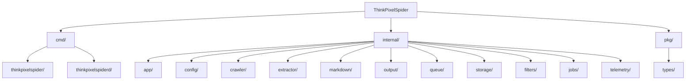
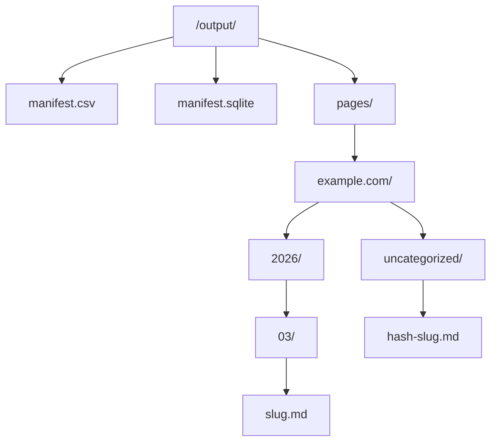
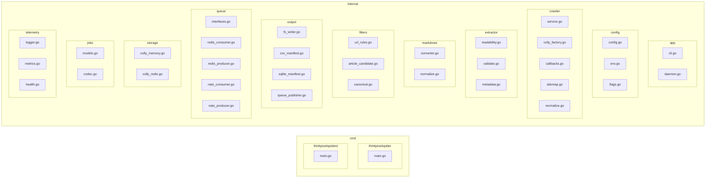

# ThinkPixelSpider Architecture

> This document captures the full architectural design, domain models, component
> responsibilities, configuration strategy, and implementation guidance for the
> ThinkPixelSpider project. It serves as the reference companion to the project
> preamble and the actionable TODO list.

---

# 1. Target shape of the system

Build **one Go codebase** with two execution modes:

* **CLI mode**

  * input: one domain
  * output: folder
  * writes:

    * Markdown files for crawled pages
    * a manifest in **CSV or SQLite**
* **Daemon mode**

  * input: queue of domains/jobs
  * output: queue of crawled page results
  * deployable as one or more stateless workers in Kubernetes

The key design decision is:

**separate crawl orchestration from page extraction.**

That means:

* Colly handles fetching/discovery
* Readability handles main-content extraction
* your own pipeline handles:

  * URL filtering
  * markdown conversion
  * output formatting
  * queue transport
  * storage choice
  * deduplication policies

---

# 2. Functional requirements translated to components

## Required behaviors

### CLI

Given:

* domain
* output folder

Produce:

* crawled content as Markdown files
* mapping of URL → relative file path
* mapping persisted as CSV or SQLite

### Daemon

Given:

* input queue receives domains / crawl jobs
* workers crawl pages
* output queue emits page results

### Shared

* HTML → Markdown
* configurable Colly storage:

  * in-memory
  * Redis
* all config loadable from env vars
* works in K8s
* supports distributed crawling

---

# 3. Recommended high-level architecture

Use a layered design.



## Main modules

### `config`

Loads config from:

* environment variables
* optionally flags in CLI mode

### `crawler`

Wraps Colly and exposes a clean interface:

* Start domain crawl
* Visit URLs
* apply restrictions
* callbacks for extracted pages

### `filters`

Contains:

* domain restriction logic
* URL normalization
* article candidate detection
* blacklist/allowlist rules

### `extractor`

Pipeline:

* fetch HTML from Colly response
* run go-readability
* validate result
* capture metadata

### `markdown`

Convert cleaned HTML or extracted content to Markdown

### `output`

Two implementations:

* filesystem + CSV/SQLite manifest
* queue producer

### `queue`

Abstract queue interfaces, with implementations:

* Redis
* NATS

### `storage`

Colly storage configuration:

* in-memory
* Redis

### `jobs`

Typed job models:

* crawl request
* crawled page result
* error report
* crawl summary

### `telemetry`

Logging, metrics, health checks

---

# 4. Core domain models

Keep the types explicit from the start.

## Crawl job

```go
type CrawlJob struct {
    JobID            string
    Domain           string
    AllowedDomains   []string
    MaxPages         int
    MaxDepth         int
    OutputFormat     string // "markdown"
    DiscoveryMode    string // "sitemap", "links", "both"
    RequestedAt      time.Time
}
```

## Crawled page result

```go
type CrawledPage struct {
    JobID              string
    URL                string
    CanonicalURL       string
    Title              string
    Byline             string
    SiteName           string
    Language           string
    PublishedTime      *time.Time
    RelativePath       string
    MarkdownContent    string
    TextContent        string
    Excerpt            string
    WordCount          int
    ContentHash        string
    HTTPStatus         int
    CrawledAt          time.Time
    ExtractionMethod   string // "readability"
    ContentType        string
}
```

## Manifest row

```go
type ManifestRow struct {
    URL           string
    CanonicalURL  string
    RelativePath  string
    Title         string
    WordCount     int
    ContentHash   string
    CrawledAt     time.Time
    Status        string
}
```

---

# 5. Execution modes

## A. CLI mode

Example:

```bash
thinkpixelspider crawl \
  --domain example.com \
  --output /data/out \
  --manifest sqlite
```

Flow:

1. Parse config
2. Build Colly collector
3. Crawl domain
4. For each valid extracted page:

   * convert to Markdown
   * write file under output folder
   * append manifest row to CSV or SQLite
5. emit summary

### Output layout recommendation



### File naming rule

Use stable deterministic paths:

* derive from normalized URL path when possible
* fallback to hash prefix for collision safety

Example:

```text
https://example.com/blog/hello-world
→ pages/example.com/blog/hello-world.md
```

If collision:

```text
pages/example.com/blog/hello-world--a1b2c3.md
```

---

## B. Daemon mode

Example:

```bash
thinkpixelspiderd
```

Flow:

1. Start queue consumer
2. Receive `CrawlJob`
3. Crawl domain
4. Emit `CrawledPage` for each extracted page to output queue
5. Emit optional `CrawlSummary` event when finished

### K8s model

Use many identical worker pods:

* each pod consumes input queue
* each pod processes jobs independently
* no local state required except temp buffers
* Redis-backed Colly storage optional when cross-worker dedup is needed

---

# 6. Queue abstraction

Define clean interfaces first.

## Input consumer

```go
type CrawlJobConsumer interface {
    Receive(ctx context.Context) (*CrawlJob, error)
    Ack(ctx context.Context, jobID string) error
    Nack(ctx context.Context, jobID string, reason string) error
}
```

## Output producer

```go
type PageResultProducer interface {
    PublishPage(ctx context.Context, page *CrawledPage) error
    PublishSummary(ctx context.Context, summary *CrawlSummary) error
    PublishError(ctx context.Context, err *CrawlError) error
}
```

## Implementations

### Redis option

Good for:

* simple queue semantics
* easy local development
* easy K8s deployment

Could use:

* Redis lists / streams

My suggestion:

* use **Redis Streams** rather than plain lists
* easier consumer groups
* better visibility for multi-worker patterns

### NATS option

Good for:

* event-based output
* distributed systems
* Kubernetes-native workflows

My recommendation:

* **input**: NATS JetStream or Redis Streams
* **output**: NATS JetStream works very nicely for downstream consumers

A practical first step:

* implement Redis Streams first
* add NATS JetStream second with the same interfaces

---

# 7. Colly storage plan

You asked specifically for configurable internal memory vs Redis storage.

Create a small adapter factory:

```go
type CollyStorageFactory interface {
    Build(cfg StorageConfig) (storage.Storage, error)
}
```

## Option 1: in-memory

Use for:

* CLI
* local testing
* single worker demo

Pros:

* fastest
* simplest

Cons:

* no persistence
* no sharing across pods

## Option 2: Redis

Use for:

* daemon mode
* distributed crawlers
* crash recovery
* duplicate suppression across workers if coordinated carefully

Be clear on one thing:
**Colly Redis storage helps with visited request tracking, but full distributed frontier management still belongs to your job/queue layer.**

That means:

* input queue distributes domains/jobs
* Colly Redis storage prevents revisiting within a crawl scope
* your queue orchestration decides which worker processes which domain

---

# 8. Domain restrictions and duplicate prevention

This is important enough to design explicitly.

## Restrict to the target site

At minimum:

* use `AllowedDomains`
* normalize `www.example.com` and `example.com`
* optionally allow a configured subdomain list

Recommended rule:

* default = same registrable domain + www
* optional flag to include subdomains

Example:

* job input: `example.com`
* allowed:

  * `example.com`
  * `www.example.com`
* optional:

  * `blog.example.com`
  * `news.example.com`

## Do not crawl the same page twice

Use a combination of:

1. Colly visited tracking
2. URL normalization before visit
3. canonical URL handling after extraction
4. content hashing

### URL normalization

Normalize before enqueue/visit:

* lowercase scheme + host
* remove fragment
* strip tracking params:

  * `utm_*`
  * `fbclid`
  * `gclid`
* sort query params
* optionally drop trailing slash consistency

### Canonical handling

After page fetch:

* if canonical URL exists and differs:

  * use canonical as primary identity
* mark aliases if needed

### Content dedup

Hash extracted markdown or text:

* if same content hash repeats, keep first or canonical copy

---

# 9. Crawl discovery strategy

Your crawler should support multiple discovery methods.

## Recommended order

### 1. Sitemap first

For WordPress, this is the highest-value discovery source.

Try:

* `/sitemap.xml`
* `/sitemap_index.xml`
* common WP plugin sitemaps

Why:

* fast
* clean
* article-heavy
* fewer noisy pages

### 2. Link discovery second

Use Colly link extraction from:

* homepage
* blog
* category pages
* article pages

### 3. Optional RSS feed support

Useful for recent articles, not full historical coverage

## Discovery modes config

```go
type DiscoveryMode string

const (
    DiscoverySitemap DiscoveryMode = "sitemap"
    DiscoveryLinks   DiscoveryMode = "links"
    DiscoveryBoth    DiscoveryMode = "both"
)
```

Default:

* `both`

---

# 10. Article candidate filtering

This is where you keep the crawl efficient.

Use a tiered strategy:

## Tier 1: URL rules

Reject obvious non-article URLs:

* `/tag/`
* `/category/`
* `/author/`
* `/search`
* `/wp-login`
* `/wp-admin`
* `/feed`
* `/comments`
* attachment/media pages
* query-heavy pages

Boost likely article URLs:

* `/YYYY/MM/slug`
* `/blog/slug`
* `/news/slug`
* `/post/slug`

## Tier 2: HTML metadata rules

On response, inspect for:

* `<article>`
* `og:type=article`
* schema.org `Article`
* `main` content region
* WordPress-like classes:

  * `.entry-content`
  * `.post-content`
  * `.article-content`

## Tier 3: extraction validation

After readability:

* minimum text length
* minimum word count
* markdown quality checks
* reject navigation-like extractions

Recommended thresholds:

* minimum 200–300 words for article candidate acceptance
* configurable via env

---

# 11. Extraction pipeline

Here is the shared page processing pipeline.

## Step 1: fetch HTML

From Colly response body

## Step 2: pre-clean HTML

Optional but useful:

* remove script/style/noscript
* remove iframes if not needed
* optionally remove cookie banners if easy to identify

## Step 3: go-readability extraction

Extract:

* title
* byline
* site name
* main HTML content
* text content
* excerpt
* length

## Step 4: post-extraction heuristics

This is where your "readability first, heuristics second" design lives.

Recommended checks:

* word count threshold
* link density threshold
* repeated boilerplate phrase detection
* reject text dominated by:

  * "related posts"
  * "subscribe"
  * "cookie"
  * "share this"
  * "leave a comment"

## Step 5: HTML to Markdown

Convert extracted content HTML to Markdown

Choose a Go HTML→Markdown library and wrap it behind an interface so you can swap later.

```go
type MarkdownConverter interface {
    Convert(html string) (string, error)
}
```

## Step 6: normalize Markdown

* trim whitespace
* collapse repeated blank lines
* normalize headings
* optionally preserve images and links
* optionally remove empty link references

## Step 7: persist or emit

Depending on mode:

* CLI: write file + manifest row
* daemon: publish page result event

---

# 12. Markdown output format

Keep Markdown output consistent and easy to index.

Recommended file content:

```md
---
url: https://example.com/blog/post
canonical_url: https://example.com/blog/post
title: Example Post
byline: John Doe
site_name: Example
crawled_at: 2026-03-16T10:00:00Z
word_count: 812
content_hash: abc123
---

# Example Post

...markdown content...
```

Benefits:

* easy downstream use
* easy local inspection
* easy re-indexing

---

# 13. CLI output persistence

You asked for CSV or SQLite.

Support both behind one manifest writer interface.

```go
type ManifestWriter interface {
    WriteRow(ctx context.Context, row ManifestRow) error
    Close() error
}
```

## CSV

Best for:

* simple demos
* export/import
* human-readable workflows

Recommended columns:

* url
* canonical_url
* relative_path
* title
* word_count
* content_hash
* crawled_at
* status

## SQLite

Best for:

* structured local querying
* dedup checks
* resuming CLI crawls later

Recommended schema:

### `pages`

```sql
CREATE TABLE pages (
  id INTEGER PRIMARY KEY,
  url TEXT NOT NULL UNIQUE,
  canonical_url TEXT,
  relative_path TEXT NOT NULL,
  title TEXT,
  byline TEXT,
  site_name TEXT,
  word_count INTEGER,
  content_hash TEXT,
  crawled_at TEXT NOT NULL,
  status TEXT NOT NULL
);
```

### indexes

```sql
CREATE INDEX idx_pages_canonical_url ON pages(canonical_url);
CREATE INDEX idx_pages_content_hash ON pages(content_hash);
```

My recommendation:

* support both
* default to SQLite for serious use
* allow CSV for simplicity

---

# 14. Daemon queue message formats

Use JSON payloads first. It keeps interoperability high.

## Input message

```json
{
  "job_id": "job-123",
  "domain": "example.com",
  "allowed_domains": ["example.com", "www.example.com"],
  "max_pages": 500,
  "max_depth": 4,
  "discovery_mode": "both",
  "requested_at": "2026-03-16T10:00:00Z"
}
```

## Output page message

```json
{
  "job_id": "job-123",
  "url": "https://example.com/blog/post",
  "canonical_url": "https://example.com/blog/post",
  "title": "Example Post",
  "relative_path": "pages/example.com/blog/post.md",
  "markdown_content": "# Example Post\n\n...",
  "text_content": "Example Post ...",
  "word_count": 812,
  "content_hash": "abc123",
  "crawled_at": "2026-03-16T10:02:00Z",
  "extraction_method": "readability"
}
```

### Optional output summary

Useful in distributed systems.

```json
{
  "job_id": "job-123",
  "domain": "example.com",
  "pages_discovered": 1200,
  "pages_visited": 480,
  "pages_extracted": 215,
  "errors": 7,
  "started_at": "2026-03-16T10:00:00Z",
  "finished_at": "2026-03-16T10:04:00Z"
}
```

---

# 15. Kubernetes compatibility design

Make workers stateless wherever possible.

## Worker pod responsibilities

* consume one crawl job
* crawl one domain at a time
* emit page events
* finish
* no dependency on local disk except temp data

## K8s-friendly configuration

Use env vars only, with optional flags overriding in CLI mode.

Examples:

* `APP_MODE=daemon`
* `QUEUE_BACKEND=redis`
* `QUEUE_REDIS_ADDR=redis:6379`
* `QUEUE_NATS_URL=nats://nats:4222`
* `COLLY_STORAGE=redis`
* `COLLY_REDIS_ADDR=redis:6379`
* `CRAWLER_MAX_PAGES=500`
* `CRAWLER_MAX_DEPTH=4`

## Health endpoints

For daemon mode, expose:

* `/healthz`
* `/readyz`
* `/metrics`

## Scaling model

You can scale by increasing worker replicas.

Best practice:

* one job = one domain crawl
* consumer group ensures one worker gets one job
* horizontal scaling naturally follows queue depth

---

# 16. Configuration model

Use a central config struct.

```go
type Config struct {
    AppMode      string
    LogLevel     string

    Crawl struct {
        MaxPages              int
        MaxDepth              int
        RequestTimeoutSeconds int
        UserAgent             string
        DelayMS               int
        RandomDelayMS         int
        Parallelism           int
        IncludeSubdomains     bool
        DiscoveryMode         string
        MinWordCount          int
    }

    Colly struct {
        StorageType string // "memory" or "redis"
        RedisAddr   string
        RedisDB     int
        RedisPrefix string
    }

    Output struct {
        Directory    string
        ManifestType string // "csv" or "sqlite"
        SQLitePath   string
    }

    Queue struct {
        Backend string // "redis" or "nats"

        Redis struct {
            Addr         string
            StreamInput  string
            StreamOutput string
            ConsumerGroup string
        }

        NATS struct {
            URL           string
            InputSubject  string
            OutputSubject string
            DurableName   string
        }
    }
}
```

## Configuration sources

Recommended precedence:

1. CLI flags
2. env vars
3. defaults

---

# 17. Suggested env vars

## General

```bash
APP_MODE=cli
LOG_LEVEL=info
```

## Crawl

```bash
CRAWLER_MAX_PAGES=500
CRAWLER_MAX_DEPTH=4
CRAWLER_TIMEOUT_SECONDS=15
CRAWLER_USER_AGENT=thinkpixelspider/1.0
CRAWLER_DELAY_MS=200
CRAWLER_RANDOM_DELAY_MS=300
CRAWLER_PARALLELISM=4
CRAWLER_INCLUDE_SUBDOMAINS=false
CRAWLER_DISCOVERY_MODE=both
CRAWLER_MIN_WORD_COUNT=250
```

## Colly storage

```bash
COLLY_STORAGE=memory
COLLY_REDIS_ADDR=redis:6379
COLLY_REDIS_DB=0
COLLY_REDIS_PREFIX=thinkpixelspider
```

## CLI output

```bash
OUTPUT_DIR=/data/out
OUTPUT_MANIFEST_TYPE=sqlite
OUTPUT_SQLITE_PATH=/data/out/manifest.sqlite
```

## Queue

```bash
QUEUE_BACKEND=redis
QUEUE_REDIS_ADDR=redis:6379
QUEUE_REDIS_INPUT_STREAM=crawl_jobs
QUEUE_REDIS_OUTPUT_STREAM=crawled_pages
QUEUE_REDIS_CONSUMER_GROUP=thinkpixelspider

QUEUE_NATS_URL=nats://nats:4222
QUEUE_NATS_INPUT_SUBJECT=crawl.jobs
QUEUE_NATS_OUTPUT_SUBJECT=crawl.pages
QUEUE_NATS_DURABLE_NAME=thinkpixelspider
```

---

# 18. Recommended code structure in more detail



---

# 19. Crawl service design

Make a single orchestrator service used by both CLI and daemon.

```go
type CrawlService struct {
    CollectorFactory   CollectorFactory
    Extractor          Extractor
    MarkdownConverter  MarkdownConverter
    PageSink           PageSink
    URLFilter          URLFilter
}
```

## Page sink interface

```go
type PageSink interface {
    SavePage(ctx context.Context, page *CrawledPage) error
}
```

Implementations:

* `FilesystemPageSink`
* `QueuePageSink`

This gives you one crawl flow and two deployment targets.

---

# 20. Colly factory details

The collector should be created from config and job parameters.

Configure:

* allowed domains
* async mode
* max depth
* user agent
* request timeout
* storage backend
* rate limiting

Example behaviors:

* reject off-domain links immediately
* apply normalization before visit
* attach callbacks:

  * `OnRequest`
  * `OnResponse`
  * `OnHTML("a[href]")`
  * `OnError`

---

# 21. What should happen on `OnHTML("a[href]")`

Do not blindly visit every link.

Pipeline:

1. resolve absolute URL
2. normalize URL
3. check allowed domain
4. check URL blacklist
5. check likely content path
6. check not already visited
7. visit

This is where most crawl efficiency is won.

---

# 22. Error handling strategy

You want deterministic behavior in both modes.

## Categorize errors

* network errors
* timeout errors
* invalid HTML
* readability extraction failures
* markdown conversion failures
* output persistence failures

## Policy

* log and continue per page
* emit error events in daemon mode
* count errors in summary
* do not fail entire crawl on one bad page

In CLI mode, write an optional `errors.csv` or store them in SQLite.

---

# 23. Observability

For daemon mode especially, add this early.

## Logs

Structured logs with fields:

* job_id
* domain
* url
* status
* elapsed_ms
* worker_id

## Metrics

Expose:

* jobs_started_total
* jobs_completed_total
* pages_visited_total
* pages_extracted_total
* extraction_failures_total
* queue_publish_failures_total
* crawl_duration_seconds

## Tracing

Optional later if you need distributed tracing

---

# 24. Concurrency model

Keep it simple initially.

## Per worker

* one crawl job at a time
* Colly async crawling within the job
* bounded parallelism

This is easier to reason about than one worker handling many jobs concurrently.

Recommended initial settings:

* parallelism: 4–8
* delay: 100–500 ms
* random delay: 100–500 ms

Later you can test more aggressive settings.

---

# 25. Security and politeness

Even for demos, include these controls.

* respect robots.txt optionally via config
* custom user agent
* per-domain delay
* request timeout
* max page count
* max depth
* content-type check: only process `text/html`
* maximum response body size

This prevents accidental bad behavior.

---

# 26. Incremental implementation phases

## Phase 1 — local CLI MVP

Goal:

* crawl one domain
* write Markdown files
* write CSV manifest

Implement:

* config from flags + env
* in-memory Colly storage
* sitemap + link discovery
* readability extraction
* markdown conversion
* filesystem output
* CSV manifest

Success test:

* run on a WordPress site
* produce 20–100 useful Markdown files

## Phase 2 — stronger CLI

Add:

* SQLite manifest
* URL normalization
* canonical handling
* content hashing
* improved article filtering
* summary stats
* resumable mode if desired

## Phase 3 — daemon MVP

Add:

* queue abstraction
* Redis Streams input/output
* queue-backed sink
* crawl summary event
* structured logs

## Phase 4 — K8s readiness

Add:

* health endpoints
* metrics
* container image
* Helm/Kustomize manifests
* graceful shutdown
* worker concurrency tuning

## Phase 5 — NATS support

Add:

* NATS JetStream consumer/producer
* same interfaces
* integration tests

## Phase 6 — distributed improvements

Add:

* Redis Colly storage
* stronger cross-worker dedup semantics
* job leases / retries
* dead-letter handling

---

# 27. Testing plan

## Unit tests

Cover:

* URL normalization
* URL filtering
* path generation
* manifest writing
* config loading
* markdown normalization

## Integration tests

Use:

* a local HTTP test server serving fake WordPress-like pages
* sitemap, category, article, tag, and off-domain links

Validate:

* only article pages are extracted
* duplicate URLs are not revisited
* output files are created correctly
* Markdown content looks correct

## Queue integration tests

For Redis and NATS:

* enqueue crawl job
* worker consumes
* emits output page messages
* emits summary

## K8s smoke test

Deploy one worker and local Redis/NATS in a dev cluster

---

# 28. Minimal first milestone I would build

If you want the fastest path to a working system, build this first:

* `thinkpixelspider`
* env + flags config
* Colly in-memory storage
* allowed domains
* sitemap discovery
* `go-readability`
* HTML→Markdown
* filesystem writer
* CSV manifest

Then prove it on 3–5 WordPress sites.

Once that works, the daemon becomes much easier because you already have:

* crawl service
* extraction
* output model

You only swap:

* input source
* page sink

---

# 29. Design choices I strongly recommend

These are the ones I would lock in early.

## Strong recommendation 1

Use **one unified crawl pipeline** for both CLI and daemon.

## Strong recommendation 2

Use interfaces for:

* queue
* manifest writer
* page sink
* Colly storage factory
* markdown converter

## Strong recommendation 3

Use **Redis Streams** before plain Redis lists.

## Strong recommendation 4

Use **SQLite as the default manifest** for CLI, with CSV optional.

## Strong recommendation 5

Keep workers **stateless** in daemon mode.

## Strong recommendation 6

Store both:

* Markdown content
* normalized plain text

Markdown is nice for output, plain text is nice for indexing and dedup.

---

# 30. Suggested roadmap summary

Build in this order:

1. CLI + in-memory storage
2. Markdown output + CSV manifest
3. SQLite manifest
4. URL normalization + article filters
5. queue abstraction
6. Redis Streams daemon
7. K8s deployment
8. NATS JetStream backend
9. Redis-backed Colly storage
10. advanced heuristics and distributed tuning

---

# 31. One concrete implementation detail worth deciding now

Use this core contract:

```go
type PageSink interface {
    SavePage(ctx context.Context, page *CrawledPage) error
}
```

Then:

* CLI mode uses a sink that writes files + manifest
* daemon mode uses a sink that publishes queue events

That one abstraction will keep the codebase clean.

---

# 32. Final recommendation

Your plan is very good, and the stack is coherent.

For your specific goals, I would build:

* **Go**
* **Colly**
* **go-readability**
* **HTML→Markdown converter**
* **SQLite for CLI manifest**
* **Redis Streams first for daemon**
* **NATS JetStream second**
* **env-based config everywhere**
* **Redis Colly storage only where distributed dedup matters**

The biggest success factor will not be the crawler library. It will be:

* URL filtering quality
* extraction validation
* clean page/result contracts
* keeping CLI and daemon on the same core pipeline
